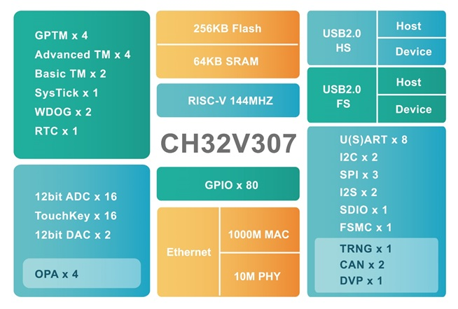

# 赤菟开发板学习计划

(如果本地使用VS Code预览，并且安装了Markdown Preview Enhanced，可以查看目录)
[toc]

## 00-简介

本项目基于openCH 赤菟 CH32V307 RISC-V 开发板~~名字好长~~，从点亮板载LED出发，逐一探索其外设，并最终完成语音识别功能。

- 开发硬件设备
  硬件上使用`VeriMake`开发的openCH 赤菟 CH32V307 RISC-V 开发板~~再次吐槽一下名字~~（简称“赤菟”开发板）。

  
  ~~懒得列举了，就是图上这些~~

  

  - CH32V307VCT6
  - ES8388音频采集与播放
  - AP3216C距离与环境光传感器(ALS&PS)
  - 128 Mbit板载Flash
  - Type-C USB接口
  - 板载WCH-Link调试器
  - 两个用户LED，一个五向开关和三个用户按键，支持睡眠唤醒
  - 六轴重力与加速度传感器
  - 磁力计
  - 硬件TF卡(micro-SD)接口
  - 硬件DVP摄像头接口，支持OV2640模组
  - 1.33寸240x240分辨率LCD屏，主控ST7789，FSMC控制
  - 11个拓展GPIO端口
  - CH9141 BLE透传模组，主从一体

  这里使用的是`V1.1.1-172F00`版本，注意与`V1.0.x`版本不同，具体参考[VeriMake开源基础教程代码仓库](https://gitee.com/verimaker/open-ch-chitu-tutorial-code)；

  ~~不会真的有人看[原理图](./docs/SCH_openCH_ChiTu_v1.1.1.pdf)吧；~~

  引脚分配
  | 端口功能             | 引脚名  | 功能       | 备注                                                              |
  |----------------------|---------|------------|-------------------------------------------------------------------|
  | 按键                 | PA0     | Wake_Up    | 按下输入1                                                         |
  |                      | PE4     | SW1        | 按下输入0                                                         |
  |                      | PE5     | SW2        | 按下输入0                                                         |
  | 五向开关             | PE1     | JOY_UP     | 按下输入0                                                         |
  |                      | PE2     | JOY_DOWN   | 按下输入0                                                         |
  |                      | PD6     | JOY_LEFT   | 按下输入0                                                         |
  |                      | PE3     | JOY_RIGHT  | 按下输入0                                                         |
  |                      | PD13    | JOY_SEL    | 按下输入0                                                         |
  | LED                  | PE11    | LED1       | 输出0点亮                                                         |
  |                      | PE12    | LED2       | 输出0点亮                                                         |
  | 串口1                | PA9     | UART1_TX   | 复用：DVP_D0                                                      |
  |                      | PA10    | UART1_RX   | 复用：DVP_D1                                                      |
  | 串口2                | PA2     | UART2_TX   | 通过跳线帽选择调试器串口连接UART1或者UART2                        |
  |                      | PA3     | UART2_RX   | 通过跳线帽选择调试器串口连接UART1或者UART2                        |
  | WiFi 接口            | PC0     | UART6_TX   | ESP8266_RX <兼容 ESP-01，ESP-01S WiFi 模块>                       |
  |                      | PC1     | UART6_RX   | ESP8266_TX <使用时注意 WiFi 天线朝向板外>                         |
  | 蓝牙 CH9141          | PC2     | UART7_TX   | CH9141_RX                                                         |
  |                      | PC3     | UART7_RX   | CH9141_TX                                                         |
  |                      | PA7     | BLE_AT     | BLE控制管脚 0为AT模式，1为透传模式                                |
  |                      | PC13    | BLE_SLEEP  | 低电平有效，低功耗模式                                            |
  | 液晶屏LCD            | PD14    | FSMC_D0    | 液晶 LCD 数据口D0                                                 |
  |                      | PD15    | FSMC_D1    | 液晶 LCD 数据口D1                                                 |
  |                      | PD0     | FSMC_D2    | 液晶 LCD 数据口D2                                                 |
  |                      | PD1     | FSMC_D3    | 液晶 LCD 数据口D3                                                 |
  |                      | PE7     | FSMC_D4    | 液晶 LCD 数据口D4                                                 |
  |                      | PE8     | FSMC_D5    | 液晶 LCD 数据口D5                                                 |
  |                      | PE9     | FSMC_D6    | 液晶 LCD 数据口D6                                                 |
  |                      | PE10    | FSMC_D7    | 液晶 LCD 数据口D7                                                 |
  |                      | PD4     | FSMC_NOE   | 液晶 LCD_RD                                                       |
  |                      | PD5     | FSMC_NWE   | 液晶 LCD_WR                                                       |
  |                      | PD7     | FSMC_NE1   | 液晶 LCD_CS                                                       |
  |                      | PD12    | FSMC_A17   | 液晶 LCD_DC                                                       |
  |                      | RST     | 复位       | 液晶 LCD_RESET                                                    |
  |                      | PB14    | LCD_BL     | 液晶背光开关，高电平有效                                          |
  |                      | PC4     | LCD_TE     | 液晶 Tearing Effect 输出（帧同步）                                |
  | 摄像头 DVP           | PA9     | DVP_D0     | 复用：UART1_TX                                                    |
  |                      | PA10    | DVP_D1     | 复用：UART1_RX                                                    |
  |                      | PC8     | DVP_D2     | 复用：TF卡 D0                                                     |
  |                      | PC9     | DVP_D3     | 复用：TF卡 D1                                                     |
  |                      | PC11    | DVP_D4     | 复用：TF卡 D3                                                     |
  |                      | PB6     | DVP_D5     |                                                                   |
  |                      | PB8     | DVP_D6     |                                                                   |
  |                      | PB9     | DVP_D7     |                                                                   |
  |                      | PC10    | DVP_D8     | 复用：TF卡 D2                                                     |
  |                      | PC12    | DVP_D9     | 复用：TF卡 CLK                                                    |
  |                      | PB7     | DVP_RESSET |                                                                   |
  |                      | PA4     | DVP_HSYN   |                                                                   |
  |                      | PA5     | DVP_VSYNC  |                                                                   |
  |                      | PA6     | DVP_PCLK   |                                                                   |
  |                      | PC7     | DVP_PWDN   |                                                                   |
  |                      | PB10    | SCCB_SCL   | 复用： DVP QMI8658A ES8388 QMC7983 AP3216C                        |
  |                      | PB11    | SCCB_SDA   | 复用： DVP QMI8658A ES8388 QMC7983 AP3216C                        |
  | MP3 ES8388           | PB12    | I2S2_LRCK  |                                                                   |
  |                      | PB13    | I2S2_SCLK  |                                                                   |
  |                      | PB15    | I2S2_SD    |                                                                   |
  |                      | PC6     | I2S2_MCLK  |                                                                   |
  |                      | PA8     | AUDIO_CTL  | I2S数据方向控制；1 : ES8388 -> MCU，录音；0 : MCU -> ES8388，播放 |
  |                      | PB10    | I2C2_SCL   | 复用：DVP QMI8658A ES8388 QMC7983 AP3216C                         |
  |                      | PB11    | I2C2_SDA   | 复用：DVP QMI8658A ES8388 QMC7983 AP3216C                         |
  | TF卡                 | PC8     | SD_D0      | 复用：DVP                                                         |
  |                      | PC9     | SD_D1      | 复用：DVP                                                         |
  |                      | PC10    | SD_D2      | 复用：DVP                                                         |
  |                      | PC11    | SD_D3      | 复用：DVP                                                         |
  |                      | PC12    | SD_CLK     | 复用：DVP                                                         |
  |                      | PD2     | SD_CMD     |                                                                   |
  | FLASH                | PA15    | SPI3_CS    |                                                                   |
  |                      | PB3     | SPI3_CLK   |                                                                   |
  |                      | PB4     | SPI3_MISO  |                                                                   |
  |                      | PB5     | SPI3_MOSI  |                                                                   |
  | IMU QMI8658A         | PB10    | I2C2_SCL   | 复用： DVP QMI8658A ES8388 QMC7983 AP3216C                        |
  |                      | PB11    | I2C2_SDA   | 复用： DVP QMI8658A ES8388 QMC7983 AP3216C                        |
  |                      | PC5     | IMU_INT    | 连接到 QMI8658A 的 INT1                                           |
  | 磁力计 QMC7983       | PB10    | I2C2_SCL   | 复用： DVP QMI8658A ES8388 QMC7983 AP3216C                        |
  |                      | PB11    | I2C2_SDA   | 复用： DVP QMI8658A ES8388 QMC7983 AP3216C                        |
  | 环境光传感器 AP3216C | PB10    | I2C2_SCL   | 复用： DVP QMI8658A ES8388 QMC7983 AP3216C                        |
  |                      | PB11    | I2C2_SDA   | 复用： DVP QMI8658A ES8388 QMC7983 AP3216C                        |
  |                      | PE6     | AP_INT     |                                                                   |
  | USB                  | PA11    | USB1_D-    |                                                                   |
  |                      | PA12    | USB1_D+    |                                                                   |
  | 调试器接口           | PA13    | SWDIO      | 调试器专用                                                        |
  |                      | PA14    | SWCLK      | 调试器专用                                                        |
  | 外部晶振             | PC14    | OSC32_IN   | 32.768KHz 专用                                                    |
  |                      | PC15    | OSC32_OUT  | 32.768KHz 专用                                                    |
  |                      | OSC_IN  |            | 外部晶振 8MHz                                                     |
  |                      | OSC_OUT |            | 外部晶振 8MHz                                                     |
  | BOOT                 | BOOT0   |            | 默认为0 。 短接跳线焊盘后为1                                      |
  |                      | PB2     | BOOT1      | 默认为0 。 短接跳线焊盘后为1                                      |
  | 扩展口               | PB0     | ADC_IN8    | 可用作：TIM3_CH3 / TIM8_CH2N / OPA1_CH1P等                        |
  |                      | PB1     | ADC_IN9    | 可用作：TIM3_CH4 / TIM8_CH3N / OPA4_CH0N 等                       |
  |                      | PA1     | ADC_IN1    | 可用作：TIM5_CH2 / TIM2_CH2 / OPA3_OUT0 等                        |
  |                      | PE13    | FSMC_D10   | 重映射功能：TIM1_CH3/UART7_RX                                     |
  |                      | PE14    | FSMC_D11   | 重映射功能：TIM1_CH4/UART8_TX                                     |
  |                      | PE15    | FSMC_D12   | 重映射功能：TIM1_BKIN/UART8_RX                                    |
  |                      | PD3     | FSMC_CLK   | 重映射功能：USART2_CTS TIM10_CH2                                  |
  |                      | PD8     | FSMC_D13   | 重映射功能：USART3_TX/TIM9_CH1N                                   |
  |                      | PD9     | FSMC_D14   | 重映射功能：USART3_RX TIM9_CH1/TIM9_ETR                           |
  |                      | PD10    | FSMC_D15   | 重映射功能：USART3_CK/TIM9_CH2N                                   |
  |                      | PD11    | FSMC_A16   | 重映射功能：USART3_CTS/TIM9_CH2                                   |

  ~~对写程序没啥用的[尺寸及位号图](./docs/Dimension_openCH_ChiTu_v1.1.1.pdf)、[3D模型](./docs/3d_openCH_ChiTu_v1.1.1.step)。~~

- 软件环境搭建

  1. 到[MounRiver官网](http://mounriver.com/)根据操作系统下载最新版`MounRiver Studio`并安装；
  2. ~~既然是中文手册就把修改语言为中文加上吧>_<~~点击HELP-->Languange-->Sampifiled Chinese-->YES修改语言为中文；
  3. 点击文件-->新建-->创建MounRiver工程，选择芯片为CH32V307VCT6，如下图，
  
  修改工程名并给出工程存储位置后点击确定。~~我看到模板类型了，不使用操作系统就选NoneOS就行。~~

- 参考资源

  1. [VeriMake开源基础教程代码仓库](https://gitee.com/verimaker/open-ch-chitu-tutorial-code)
  整理在[这里](./demos/)~~很有可能out of date，本人不负责~~
  2. [WCH沁恒官网](https://www.wch.cn/)CH32V307相关文档 [数据手册](https://www.wch.cn/downloads/CH32V307DS0_PDF.html) [内核手册](https://www.wch.cn/downloads/QingKeV4_Processor_Manual_PDF.html) [应用手册](https://www.wch.cn/downloads/CH32FV2x_V3xRM_PDF.html)
  整理在[这里](./docs/)

## 01-LED闪烁

~~第一个项目当然是从Hello World点亮LED开始。（笑）~~

## 02 按键
